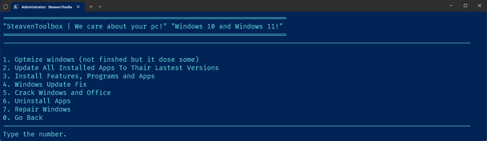

# SteavenToolBox
A Free Open Source Toolbox For Windows 11 and Windows 10!

> **Readme**

that you can use to install apps, speed up, uninstall preinstalled apps, reinstall preinstalled apps, and more

and even that you can find youtubers speed up scripts inside it so you can just do it from toolbox

Get it right now to edit your windows and make it complity your own

Launch Command:

`irm github.com/SteavenToolBox/Windows/raw/main/Run.ps1 | iex`